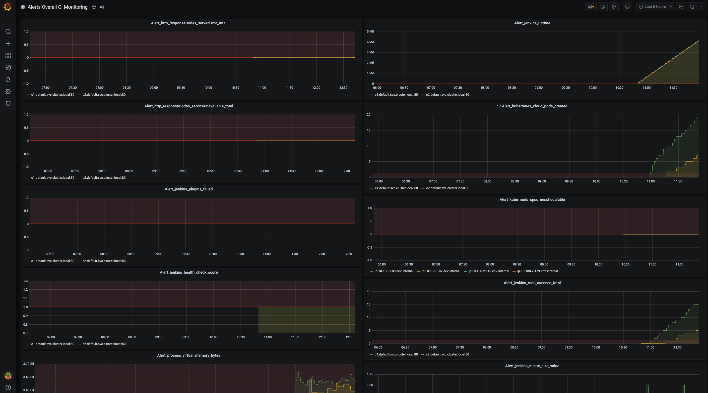

# CIMonitoringGrafana

This repo contains grafana dashboards to monitor Cloudbees CI instances.
It assumes you have setup the additional scrapped Configurations in Prometheus.

There is only 1 change you need to make and that is related to process_virtual_memory check as it is needed to specify the fqdn of the instances to monitor (otherwise there is too much noise)

---

## Main Dashboard 
- Overall CI Monitoring.json -> All in one dashboard

- Alerts Overall CI Dashboard -> Alerts for Overall CI Monitoring Dashboard
 
## Detailed Dashboards
all the rest
