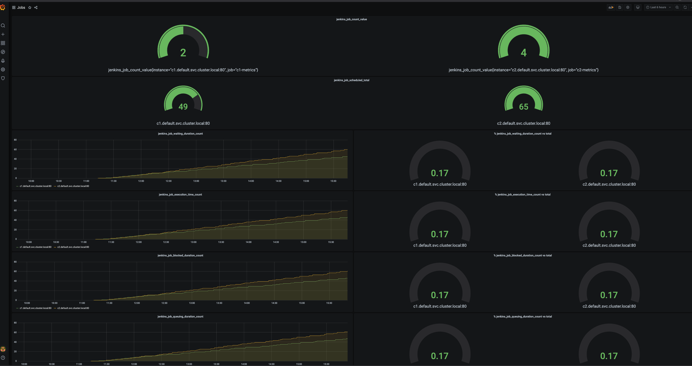
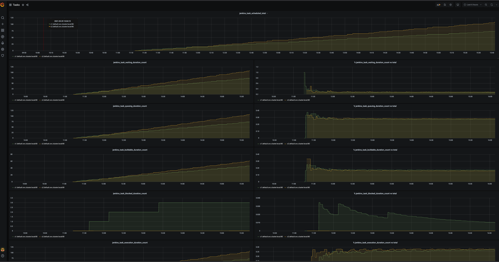

# CIMonitoringGrafana

This repo contains grafana dashboards to monitor Cloudbees CI Controllers.
It assumes you have setup the additional scrapped Configurations in Prometheus.
it also assumes you have the Prometheus Monitoring Plugin installed in all your controllers and the endpoint
`http(s)://<CJOC_URL>/<controller>/prometheus` returns metrics.

Example of Scrapped Configuration for CI Controllers
- m1-typep && m1-typep2 are the Controllers' name
```yaml
    additionalScrapeConfigs:
      - job_name: 'm1-typep-metrics'
        metrics_path: '/m1-typep/prometheus'
        static_configs:
        - targets: ['m1-typep.default.svc.cluster.local:80']
      - job_name: 'm1-typep2-metrics'
        metrics_path: '/m1-typep2/prometheus'
        static_configs:
        - targets: ['m1-typep2.default.svc.cluster.local:80']
```

You can simply import any of these dashboards in your prometheus/grafana setup

There is only 1 change you need to make and that is related to process_virtual_memory check as it is needed to specify the fqdn of the instances to monitor (otherwise there is too much noise)

---

## Main Dashboard 

Main Monitoring and Alerting Dashboards:
- Overall CI Monitoring.json -> All in one dashboard


- Alerts Overall CI Dashboard -> Alerts for Overall CI Monitoring Dashboard
 

## Advanced Dashboards
Under advance/ folder, you can find an advanced set of dashboards for you to use if you think so.

Advanced Dashboards:
- CJOCListeners.png -> CI Controller's webhooks towards OC


- Executors.png -> CI Controller's executor monitoring dashboard


- GeneralInfo.png -> CI Controller's Status and Uptime Monitoring Dashboard


- Jobs.png -> CI Controller's Job Properties Monitoring Dashboard


- NodeInfo.png -> CI Controller's Node Info Monitoring Dashboard


- Plugins.png -> CI Controller's Plugins Monitoring Dashboard


- Projects.png -> CI Controller's Projects Monitoring Dashboard


- Queue.png -> CI Controller's Queue  Monitoring Dashboard


- Runs.png -> CI Controller's Runs Monitoring Dashboard


- Servlet.png -> CI Controller's Servlets Monitoring Dashboard


- Tasks.png -> CI Controller's Tasks  Monitoring Dashboard


- health_checks.png -> CI Controller's health checks Monitoring Dashboard


- httpInfo.png -> CI Controller's httpInfo Monitoring Dashboard


- k8s.png -> CI Controller's k8s info Monitoring Dashboard


- systemMetrics.png -> CI Controller's System Metrics Monitoring Dashboard


- CI_JVM.json -> CI Controller's JVM Monitoring Dashboard
